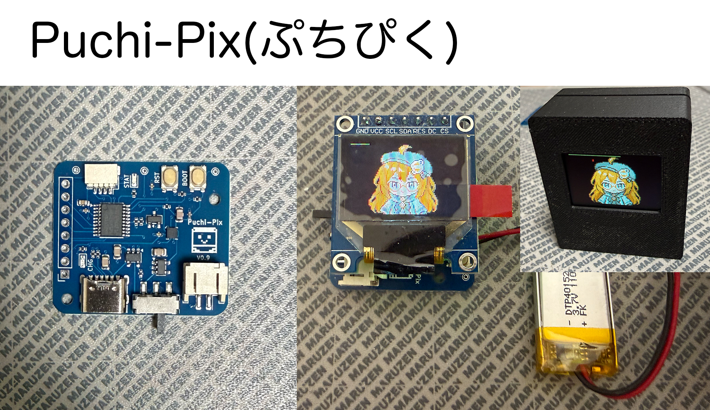

# Puchi-Pix (ぷちぴく)


A tiny pixel art display kit powered by STM32G030F6P, with a 96x64 OLED (SSD1331) or TFT display.

## Concept



Puchi-Pix was born from a simple desire: to carry pixel art animations in your pocket.

It pairs an STM32G030F6P with a small OLED, targeting a keychain-sized form factor. Rather than a coin cell with its tedious battery swaps, the board integrates a LiPo charger on-board — unusual for something this small, but essential for a device meant to live in your pocket. Exposed GPIO and an onboard accelerometer also make it a capable dev board.

The STM32G030F6P has just 32KB of flash. Fitting animated pixel art into that space demands inter-frame delta compression, 4-bit palettes, and every byte counted. The kind of constraint that once made a project like this feel out of reach for a weekend hack.

Enter the age of coding agents. What used to take careful hand-optimization now becomes a conversation — iterate on compression schemes, generate frame data, and push against hardware limits at the speed of thought. The constraint doesn't go away, but it stops being a barrier and starts being a craft.

Puchi-Pix is a project built for this era — constrained hardware, creative ambition, and an AI coding agent to bridge the gap.

## STM32G030 BOOT0 pin issue

The factory default option bytes have `nBOOT_SEL=1`, which ignores the physical BOOT0 pin. A fresh (empty flash) chip boots into the bootloader automatically, but once firmware is written, the BOOT button has no effect.

Before the first firmware upload, set `nBOOT_SEL=0` via STM32CubeProgrammer CLI:

```bash
STM32_Programmer_CLI -c port=/dev/cu.usbserial-XXXXX br=115200 -ob nBOOT_SEL=0
```

Verify with:

```bash
STM32_Programmer_CLI -c port=/dev/cu.usbserial-XXXXX br=115200 -ob displ
```

`nBOOT_SEL : 0x0 (BOOT0 signal is defined by BOOT0 pin value (legacy mode))` means BOOT+RST will work.

## ESP32 upload fails despite BOOT+RST

On the ESP32 board, entering the bootloader with BOOT+RST sometimes doesn't take — the upload hangs at `Connecting...` for a while and then errors out with:

```
A fatal error occurred: Failed to connect to ESP32-C3: No serial data received.
```

BOOT (GPIO9) is a strapping pin sampled the moment reset is released, so what matters is the button order, not how long anything is held:

1. Press and **hold** BOOT
2. Press and release RST while still holding BOOT
3. Wait a beat, **then** release BOOT — releasing it before (or together with) RST boots the app normally instead
4. Give the USB port a second or two to re-enumerate, then start the upload

If it still fails, power-cycle the board completely and enter the bootloader
before plugging USB back in (on battery power) — this connects reliably:

1. Unplug USB
2. Slide switch OFF, then back ON
3. BOOT+RST (sequence above)
4. Plug USB back in, wait for the port to appear, then start the upload
